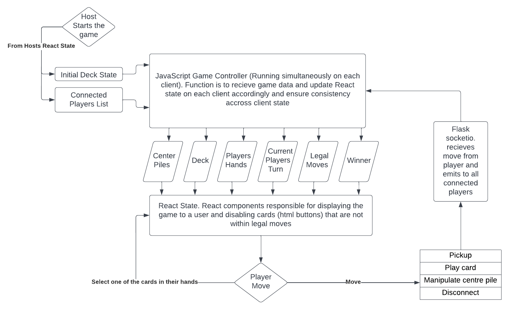

# gaming-lounge

## Technologies Used:
* CSS
* Javascript
* Node.js
* React
* flask_socketio
* socket.io-client
* flask

## About the Project
This project is an online multiplayer card game called Nine Locks. Nine Locks is a game invented by me and some friends so the rules will be unfamiliar. There is a read the rules section within the app, and at the bottom of this README.

The app works by users creating and joining game rooms connected using socketio

## Instillation and serving locally

The backend is developed using flask and front end using react. These are the steps to running the build locally. 


### Back End Build

To run the app using pipenv, first ensure pipenv is installed. Run:
```
pip install pipenv
```

From the home directory (gaming-lounge) start a pipenv shell. Run:
```
pipenv shell
```

Then install dependencies from the Pipfile. run:
```
pipenv install
```

And finally run the flask app using
```
flask run --port=5000
```

### Front End Build

to run the app using nodemon, first ensure nodemon is installed. Run:
```
npm install -g nodemon # or using yarn: yarn global add nodemon
```
to install nodmeon globally ([ref](https://npmjs.com/package/nodemon))

From the client directory. Run:
```
npm i
```
to install the front end dependncies.

Start the local server. Run: 
```
nodemon run
```

The app should now be accessible from http://localhost:3000/

When running locally, add multiple players to a game by opening the app on several tabs and have one host the game, and join the game from the other tabs.

## Features
* From the home page users can create a new game or join a game with a code
* A chat is available for the lobby on the right side to communicate with other players.
* Players can make moves within the game when it is their turn, indicated by the tooltip in the top right, by clicking on the cards.
* Players leaving/disconnecting from the game has been handled to ensure it will not cause issues for remaining players, who can carry on playing. Unless the leaving person was the host in which case the game is disbanded.

## General Approach

The game uses socket.io to produce the live updating flow. The general approach of the client communication using the sockets is as shown in the flow chart.

Client/Socket interaction flow     | 
:-------------------------:|
 |

Instances of rooms are handled by adding users to a socket.io room with a specific key when joining a game. When any communication is needed for one specific room, any data from a client includes this room code. When the flask socket recieves anything specific to a room it will transmit the data back to that room only.

When users load the app a request to the backend is made for a uuid, so that each user on the app can be identified without any formal authentication. When creating a room the hosts uuid is used as the room code.


## Nine Locks Rules

### Set Up

Nine Locks is a game played with 2-4 players. 
At the start of the game each player is dealt two hands of three cards each, 
and nine cards are placed facedown in a 3x3 grid. One of each players hands is visible to the other players, and the other is hidden.
The game begins by flipping the centre card in the 3x3 grid.

### Gameplay

At the start of each turn the player may play a card or pick up.
 

#### Playing a Card


Cards can be played in 
ascending or descending order on cards of the same colour (regardless of the suit), or on cards with the same value of the oppisite colour.
For example a red 2 could have a red ace, red 3 or black 2 played on it. Kings can be played on aces and vice-versa.
After playing a card the turn ends.


#### Picking up


If a player can not play a card they must pick up. They can also choose to pickup even if they have playable cards.
When picking up the card is placed into the hand with the least number of cards (When it is equal the card goes to the hidden hand)
After picking up, the player must then unlock a new pile by revealing a facedown card. Once all cards are face-up, after picking up a player can unlock any locked pile instead.
If all cards are already in an unlocked state when a player picks up, their turn immediately ends.


#### If you can't play or pickup


If at the start of a turn a player can not play any card, and can not pickup becuase the deck is empty, they are then locked out of the game and get no more turns for the remainder of the game.
The player may still be able to win (see Winning below)


### Winning

The winner of the game is the first player to get rid of all cards from their visible hand, by playing them onto the piles in the middle.

If All Player Are Locked Out

When all players become locked out the game ends, and the player with the least number of cards in their visible hand is the winner.
If multiple players have the same number of visible cards, of those players the one with the leaset number in their hidden hand is the winner.
If it is still a tie, the final result is a tie.

### Pile Locking

The nine piles in the center have three states: face-down, locked, and unlocked.
Piles change state when players pick up (See Picking up above), when a player activates a key (See The Nine Key below) or when the pile has a total of 5 cards in it.
Once a pile has 5 cards it becomes locked and can not be played on until it is unlocked.

### The 9 Key 

When a Player either plays a 9, or reveals a face-down card that is a 9, they must then use the key.
The key can be used on any of the center piles. When used on either a face-down or locked pile, the pile becomes unlocked.
When used on an unlocked pile, the pile becomes locked.
9's are important! They can be used to lock a pile to prevent a player from winning, or unlock a pile you need so you can win.
